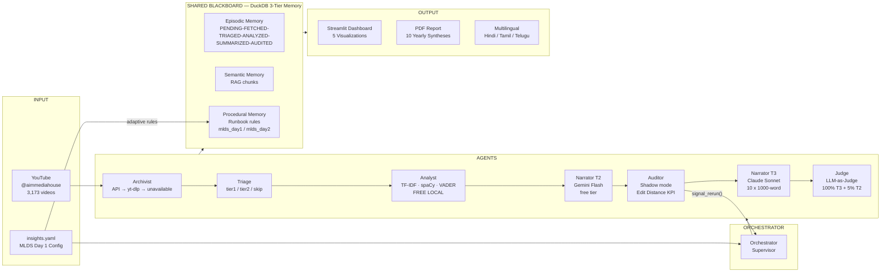

# AIM Transcript Intelligence
### Content Intelligence Dashboard — MLDS 2026 Hackathon

> *"We didn't just analyze AIM's past. We built the intelligence layer AIM needs to make better content decisions — starting today."*

**10 years · 3,173 videos · Under $1 total LLM cost**

<!-- Fill in after pipeline runs — use the most surprising real finding -->
> **Key finding:** `[FILL: e.g. "AIM covered RAG 2 years before it went mainstream — and the data proves it"]`

---

## What This Is

An automated 7-agent pipeline that transforms 10 years of AIM Media House YouTube transcripts into **actionable editorial, sponsorship, and brand intelligence** — the kind AIM's team can open on Monday morning.

| AIM Business Goal | What We Deliver |
|---|---|
| Audience growth | Topics rising fast that AIM is undercovering — editorial calendar gaps |
| Sponsorship revenue | Companies appearing in high-performing content — who to pitch |
| Event programming | Speakers + topics with highest engagement — MLDS lineup decisions |
| Brand authority | Trends AIM called before mainstream — credibility proof |
| Content strategy | What gets watched vs what gets produced — the gap |

---

## Demo

```bash
# Judges: run this to see the full pipeline end-to-end in ~5 minutes
python run.py --sprint-demo

# Launch dashboard
streamlit run dashboard/app.py
```

<!-- Fill in after pipeline runs -->
**Live dashboard:** `[FILL: screenshot or gif of dashboard]`

---

## Architecture



---

## Five Visualizations

| Chart | Business Value |
|---|---|
| **Hype Cycle** | Rising topics AIM is undercovering — editorial opportunities |
| **Speaker Network** | Most influential guests and brand associations |
| **AIM Predicted Early** | Trends called before mainstream — brand authority proof |
| **Hype vs Reality** | What gets watched vs what gets produced — sponsorship targeting |
| **Sentiment Trajectory** | How audience tone has shifted over 10 years |

---

## Agent Architecture

| Agent | Decision It Makes |
|---|---|
| **Orchestrator** | Routes work, reads YAML config, triggers reruns, crash recovery |
| **Archivist** | Per video: youtube-transcript-api → yt-dlp fallback → unavailable |
| **Triage** | Quality score → tier2 (Gemini) / tier1 (local only) / skip |
| **Analyst** | TF-IDF keywords + spaCy NER + VADER sentiment — all 3,173 videos |
| **Narrator T2** | Gemini Flash 1-paragraph summary per video (free tier) |
| **Auditor** | Shadow mode first 100 videos → Edit Distance KPI → signal_rerun() |
| **Narrator T3** | Claude Sonnet 1000-word yearly synthesis × 10 years |
| **Judge** | 100% of yearly syntheses + 5% random Tier 2 sample |

### The Agentic Loop
Auditor → `signal_rerun(video_id, reason, prompt_adjustment)` → Orchestrator re-queues → Narrator reruns with adjusted prompt → max 2 reruns per video. Every decision logged to `agent_log` JSON in DuckDB.

---

## Shared Blackboard — DuckDB 3-Tier Memory

*Informed by Anshul Singh & Sanketh Gadadinni (MathCo) — "Building Smarter AI Agents with Memory and Context" — MLDS 2026 Day 1*

| Tier | Table | Purpose |
|---|---|---|
| **Episodic** | `episodic` | Immutable event log per video. Status, cost, agent decisions |
| **Semantic** | `semantic` | Transcript chunks for RAG. Grounds Narrator + Judge |
| **Procedural** | `procedural` | Runbook rules. Updated by YAML config at startup |

---

## Adaptive Architecture — Day 1 → Day 2

*Informed by Nikhil Daxini (EY GDS) — "From Cost Center to AI Command Center" — MLDS 2026 Day 1*

The Orchestrator reads `context/insights.yaml` at startup and **reconfigures the pipeline without code changes**:

```bash
# After Day 2 sessions — add new insights to insights.yaml, then:
python run.py --complete-deep-dive
# Orchestrator re-adapts automatically. Re-synthesis costs ~$0.50.
```

This system was **submitted during MLDS 2026**. It is designed to learn from the same conference it was evaluated at.

---

## MLDS 2026 Day 1 — Applied Directly

| Speaker | Company | Session | Applied As |
|---|---|---|---|
| Anshul Singh & Sanketh Gadadinni | MathCo | *Building Smarter AI Agents with Memory and Context* | 3-tier DuckDB blackboard |
| Shashank Rao | Atlassian | *Agentic Request Delegation and Resolution* | Orchestrator Supervisor pattern |
| Vaibhav Jain | Millennium | *Building Trust in an AI Agent When Stakes Get Real* | Edit Distance KPI + shadow mode |
| Ayushman Gupta & Chirag Jain | Genpact | *Unified Framework for...Agentic AI Systems* | Judge on full reasoning traces |
| Nikhil Daxini | EY GDS | *From Cost Center to AI Command Center* | Adaptive YAML config layer |
| Alok Shrivastwa | Microland | *Agentic AI is Easy. Running It in Production is Not.* | Shadow mode + intent logging |
| Prof. Snehanshu Saha | BITS Pilani | *Intelligence in Structure, Not Policy* | Hype Cycle structural graph |
| Vignesh Subrahmaniam | Intuit | *RL and beyond: Grounding AI in a Stochastic World* | Judge grounds vs source transcripts |
| Prof. Ganesh Ramakrishnan | IIT Bombay | *BharatGen: Sovereign & Shared* | AI4Bharat multilingual output |

---

## Cost Breakdown

| Component | Tool | Cost |
|---|---|---|
| Transcript fetch | youtube-transcript-api + yt-dlp | Free |
| NER + sentiment + topics | spaCy + VADER + TF-IDF | Free |
| Video summaries (~500) | Gemini Flash (free tier) | $0.00 |
| Yearly syntheses (×10) | Claude Sonnet | ~$0.50 |
| Judge evaluation | Claude Sonnet | ~$0.20 |
| **Total** | | **< $1.00** |

---

## Setup

```bash
git clone https://github.com/[YOUR_USERNAME]/aim-transcript-intelligence
cd aim-transcript-intelligence
python -m venv venv && source venv/bin/activate
pip install -r requirements.txt
python -m spacy download en_core_web_sm

# Add API keys
cp .env.example .env
# Fill in: ANTHROPIC_API_KEY, GOOGLE_API_KEY, YOUTUBE_API_KEY

# Run pipeline
python run.py --sprint-demo          # ~5 min, for live demo
python run.py --complete-deep-dive   # full 3,173 videos

# Launch dashboard
streamlit run dashboard/app.py

# Generate PDF report
python report/generator.py
```

---

## Tech Stack

```
Data:       youtube-transcript-api · yt-dlp · YouTube Data API v3
Storage:    DuckDB (analytics blackboard) · JSON transcript cache
Local ML:   scikit-learn TF-IDF · spaCy en_core_web_sm · VADER sentiment
LLM T2:     Gemini 1.5 Flash (free tier) — bulk video summaries
LLM T3:     claude-sonnet-4-6 — yearly synthesis + Judge
Dashboard:  Streamlit · Plotly · Pyvis
Report:     Jinja2 → WeasyPrint PDF
Multilingual: AI4Bharat Dhruva API
```

---

*MLDS 2026 Hackathon — AIM Media House · Built during the conference it analyzes.*
